**CLIProxyAPI Plus 反代，更多大模型Api支持，Docker部署教程**

这是CLIProxyAPI的 Plus 版本，在主线项目的基础上增加了对第三方提供商的支持。

包括：Kiro，GitHub Copilot等等

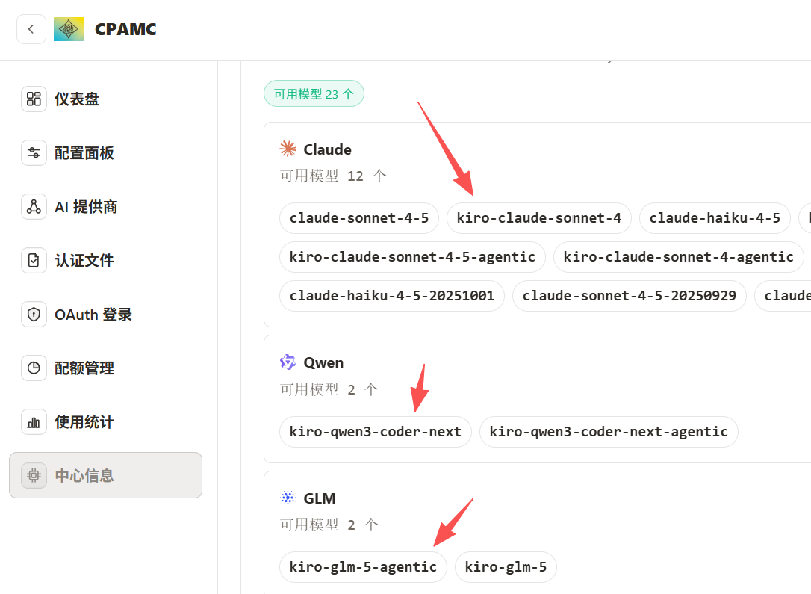

推荐服务器部署，不要选择国内地区，选择Linux版本上手快

腾讯云新加坡，硅谷，东京地区价格是199元一年，2核4G30M带宽，60GBSSD盘 1.5T月流量，推荐硅谷地区CN2线路↓↓↓

购买地址：https://curl.qcloud.com/oyWDLkRJ


也可以看做是CLIProxyAPI Plus（CLIProxyAPI ）的Docker版本部署教程

**教程**

1.Ubuntu24系统更新依赖

```
sudo apt update
sudo apt install -y ca-certificates curl
```

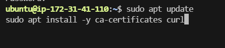

2.添加 Docker 官方 GPG 密钥

```
sudo install -m 0755 -d /etc/apt/keyrings
sudo curl -fsSL https://download.docker.com/linux/ubuntu/gpg -o /etc/apt/keyrings/docker.asc
sudo chmod a+r /etc/apt/keyrings/docker.asc
```

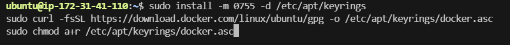

3.添加 Docker 官方软件源

```
sudo tee /etc/apt/sources.list.d/docker.sources <<EOF
Types: deb
URIs: https://download.docker.com/linux/ubuntu
Suites: $(. /etc/os-release && echo "${UBUNTU_CODENAME:-$VERSION_CODENAME}")
Components: stable
Architectures: $(dpkg --print-architecture)
Signed-By: /etc/apt/keyrings/docker.asc
EOF
sudo apt update

```

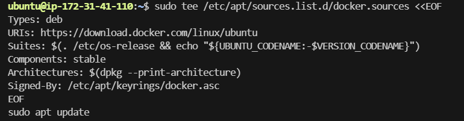

4.安装 Docker Engine

```
sudo apt install -y docker-ce docker-ce-cli containerd.io docker-buildx-plugin docker-compose-plugin
```

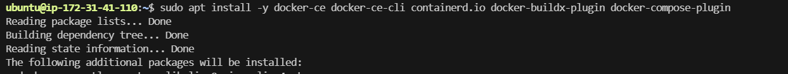

5.启动并设置开机自启

```
sudo systemctl enable docker
sudo systemctl start docker
```

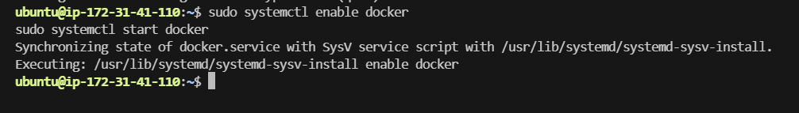

6.创建一个目录用来存放文件

```
mkdir -p ~/CLIProxyAPIPlus/auths ~/CLIProxyAPIPlus/logs && cd ~/CLIProxyAPIPlus
```

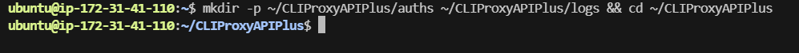

7.下载配置文件

curl -o config.yaml https://raw.githubusercontent.com/router-for-me/CLIProxyAPIPlus/main/config.example.yaml

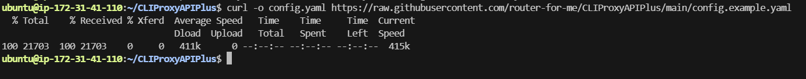

8.编辑文件，allow-remote: false改为true， secret-key: ''填入密码123456，服务器部署密码一定要复杂！！！我这里是教程示例

```
nano config.yaml
```


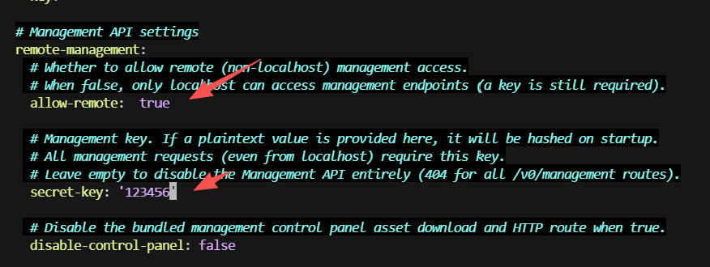

9.创建 docker-compose.yml

```
nano ~/CLIProxyAPIPlus/docker-compose.yml
```

把下面内容完整粘进去后保存

```
services:
  cli-proxy-api:
    image: eceasy/cli-proxy-api-plus:latest
    pull_policy: always
    container_name: cli-proxy-api-plus
    ports:
      - "9999:8317"
    volumes:
      - ./config.yaml:/CLIProxyAPI/config.yaml
      - ./auths:/root/.cli-proxy-api
      - ./logs:/CLIProxyAPI/logs
    restart: unless-stopped
```

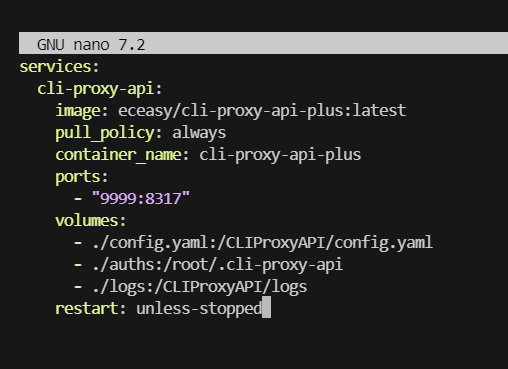

10.普通启动

```
sudo docker compose up -d
sudo docker ps
```

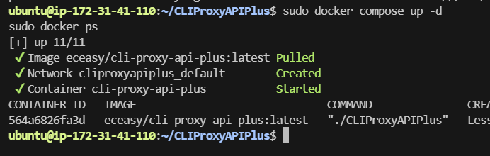

11.登录，在浏览器打开，输入之前设置的密码123456

http://你的服务器IP:9999/management.htm


11.CLIProxyAPIPlus 的 WebUI 目前没有集成 Kiro 的登录界面，必须通过在容器内执行 CLI 命令完成认证，Token 认证成功后会自动保存到映射目录

```
sudo docker run --rm -it \
  --name cli-proxy-api-plus-kiro \
  -p 10099:8317 \
  -v ~/CLIProxyAPIPlus/config.yaml:/CLIProxyAPI/config.yaml \
  -v ~/CLIProxyAPIPlus/auths:/root/.cli-proxy-api \
  -v ~/CLIProxyAPIPlus/logs:/CLIProxyAPI/logs \
  eceasy/cli-proxy-api-plus:latest \
  ./CLIProxyAPIPlus kiro --builder-id

```
  
主容器继续占用 9999:8317。

临时登录容器改走 10099:8317，避免和主容器冲

  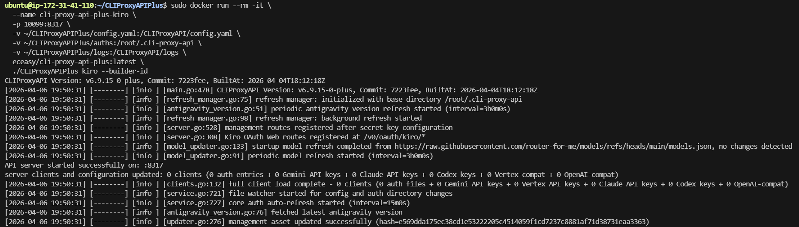

12.授权kiro

http://你的服务器IP:10099/v0/oauth/kiro

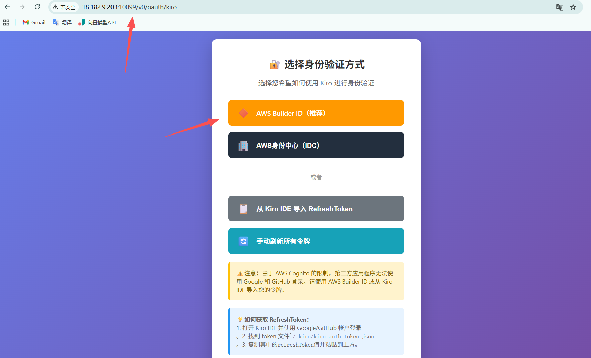

13.登录即可

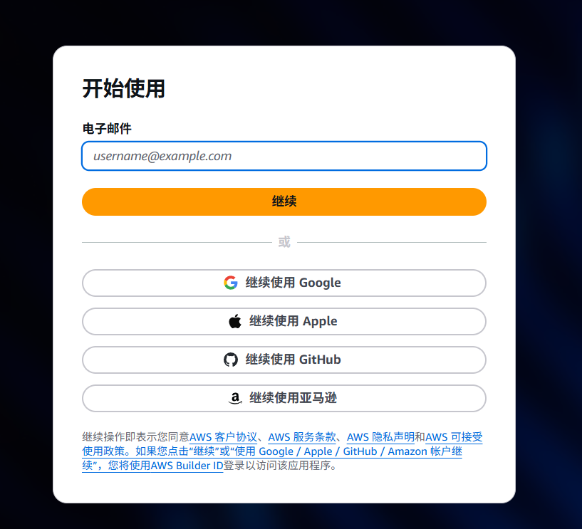

14.成功

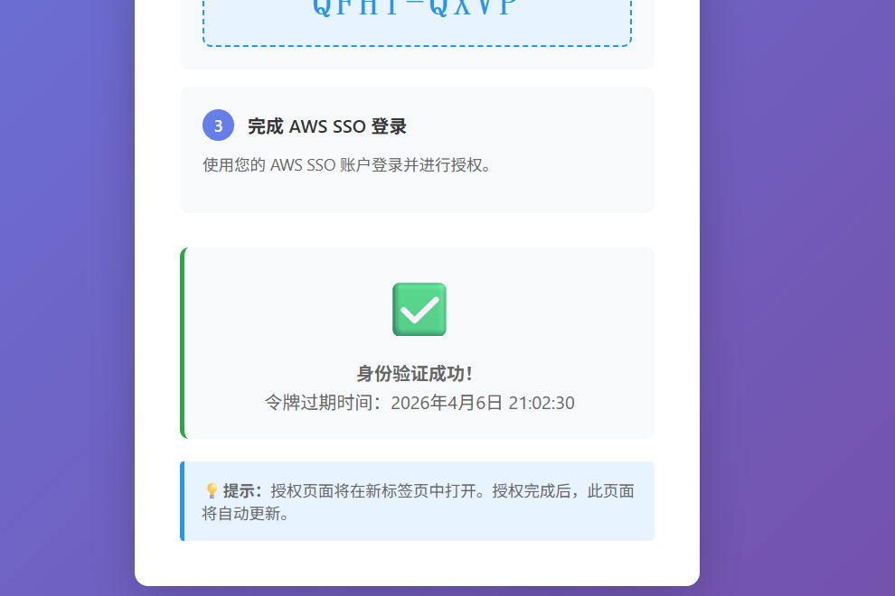

15.出现认证文件

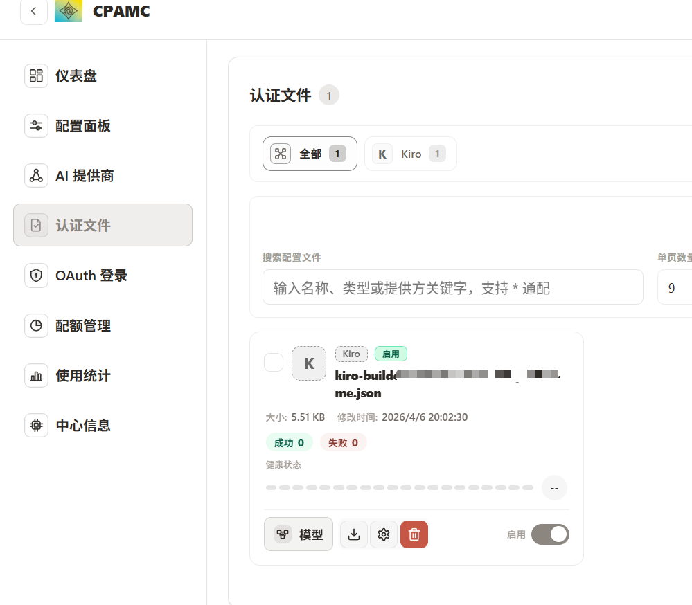

大模型也出现了

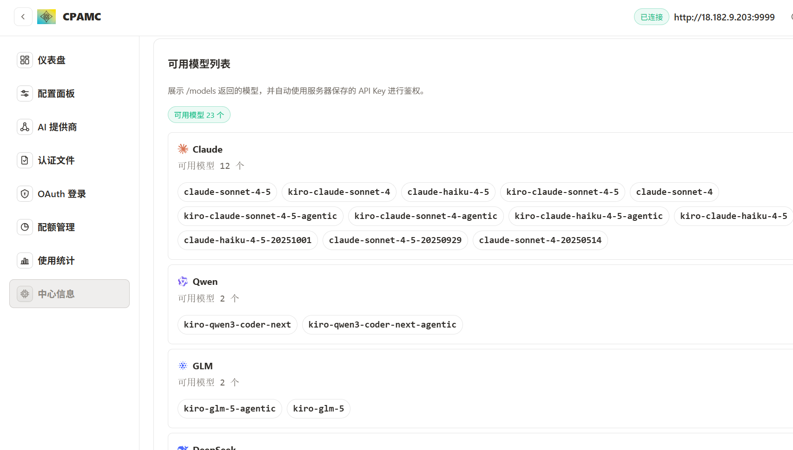

调用接口是：http://你的服务器IP:9999

模型是：kiro-claude-sonnet-4


